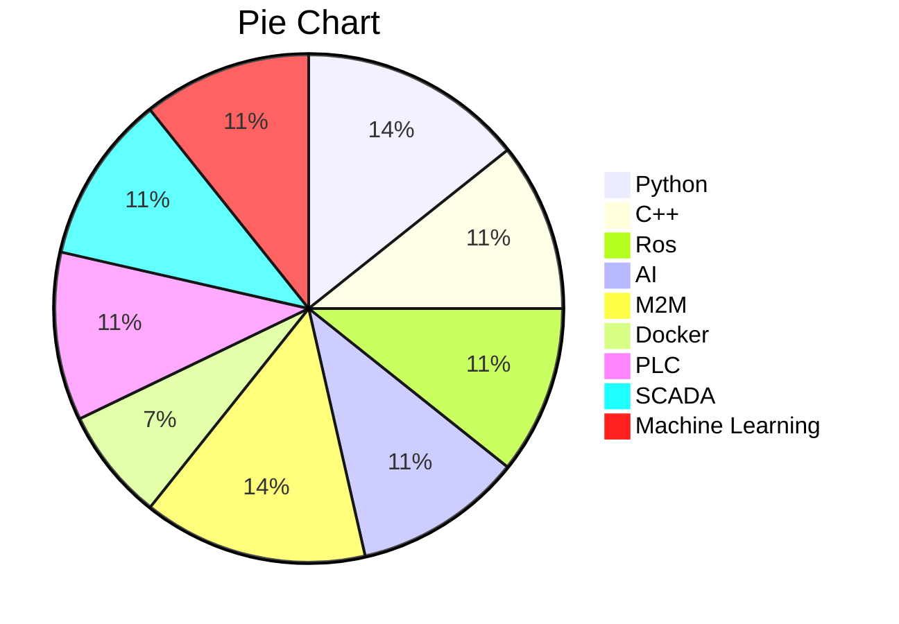

| layout  | title | permalink | author_profile | redirect_from |
| ------- | ----- | --------- | -------------- | ------------- |
| archive | CV    | /cv/      | true           | /resume       |



Education
======
* Master's degree Automation and Robotics (2013 - 2014)
* Engineer's degree - Electronics (2008 -2013)

Work experience
======
* Vision and Automation Engineer at **AGEVE**
  - AGEVE is a company with many years of experience selling its own industrial trucks. I ampart of the R&D department, which mainly focuses on developing self driven trucks. UsingROS (robotic operating system) and Deep Learning Techniques we are develoving our newnavigation system

* Vision and Automation Engineer at **AUSIL Systems**
  * Ausil is a small company that provides computer vision solutions. At Ausil I was in charge ofthose projects where the traditional computer vision solutions didn’t work and Deep learningtechniques were needed instead.
  

- Project Manager at **ASSI**
  - My job at ASSI consisted on managing projects involving PLC-SCADA programming, software-hardware communication and business understanding, mainly in the chemical industry. Inaddition, I also worked on other business areas, such as Airports (Pakistan, Denmark, Swe-den), where I have had the opportunity to learn different automation tools.

- Field Engineer at **ENCO**
  - During my time at ENCO I worked with a huge varity of SCADA’s (GE Cimplicity, Ifix, Wonder-ware), PLC’s (Bechkoff, Siemens, Schneider, EATON) and Data Base systems (M.SQL, MySQL).

- Internship - Maintenance team at **SEAT S.L**
  - My work at SEAT consisted on designing a new database using Microsoft SQL to store the datausedatthesparepartswarehouse.Usingstoredprocedures,triggersandviews,allthesedatacould then be analyzed and manipulated.

Skills
======

~~~gfm

~~~

  <ul>
    
  </ul>

Teaching
======
  <ul>
    
  </ul>
