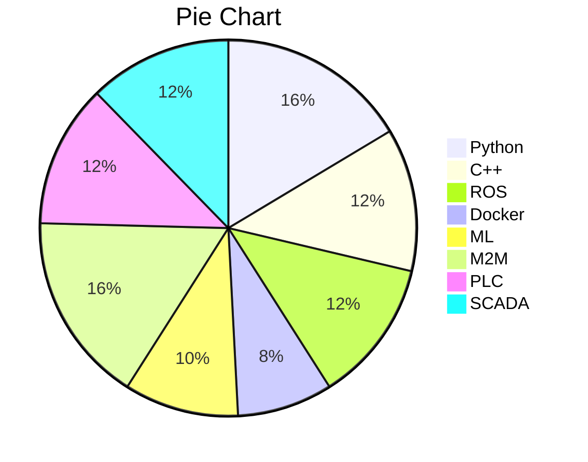



Education
======

* Master's degree Automation and Robotics (2013 - 2014)

* Engineer's degree - Electronics (2008 -2013)

  

Work experience
======
* Vision and Automation Engineer at [**AGEVE**](https://ageve.net/)

* Vision and Automation Engineer at [**AUSIL Systems**](http://www.ausilsystems.eu/)

- Project Manager at [**ASSI**](https://www.assi.es/)
  
- Field Engineer at [**ENCO**](https://www.encoweb.com/)
  
- Internship - Maintenance team at [**SEAT S.L**](https://www.seat.es/)

Skills
======

~~~gfm

~~~